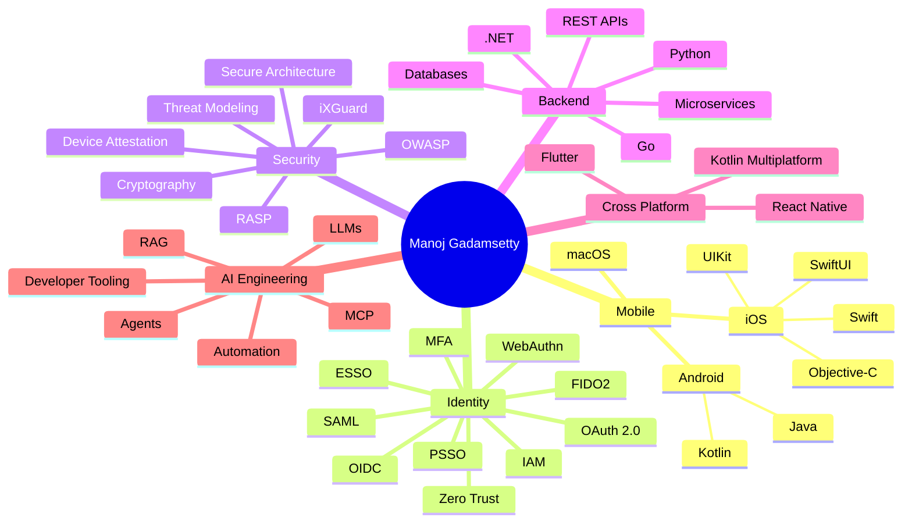
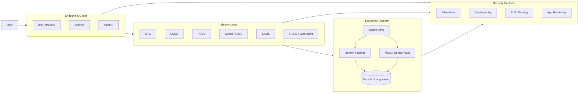
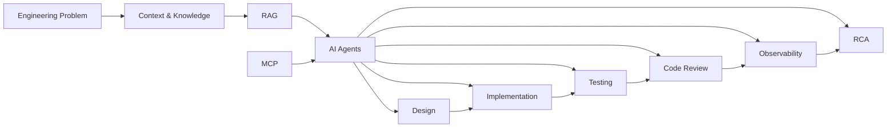
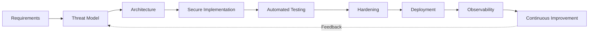
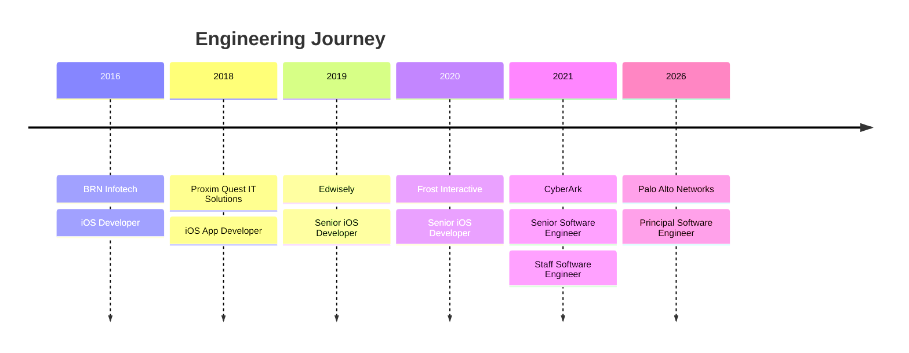

# Hi, I'm Manoj Gadamsetty

### Principal Software Engineer · Mobile · Identity · Security · AI

I build **secure, scalable enterprise software** across mobile, endpoint, identity, backend, and AI-assisted engineering systems.

Currently a **Principal Software Engineer at Palo Alto Networks**, working on enterprise identity and endpoint security across **iOS, iPadOS, and macOS**, with a strong focus on **ESSO/PSSO, authentication, secure credential management, automation, and AI-native engineering**.

10+ years of software engineering experience · 150+ RCAs · 99.99% crash-free stability across production mobile applications.

---

## Engineering at a Glance



---

## What I Build

My work sits at the intersection of **platform engineering, security, identity, and developer productivity**.

| Area                  | Focus                                                   |
| --------------------- | ------------------------------------------------------- |
| **Mobile & Endpoint** | iOS · Android · macOS · Swift · Kotlin                  |
| **Identity**          | IAM · ESSO · PSSO · OAuth · OIDC · SAML · MFA           |
| **Device Management** | MDM · Device Trust · Enrollment · Enterprise Policies   |
| **Security**          | Threat Modeling · Cryptography · OWASP · iXGuard · RASP |
| **Backend**           | Go · .NET · Python · REST APIs · Microservices          |
| **Cross-Platform**    | React Native · KMM · Flutter                            |
| **AI Engineering**    | LLMs · RAG · MCP · Agents · Automation                  |
| **DevSecOps**         | CI/CD · Testing · Code Review · Security Automation     |

---

## Identity & Security Architecture

A simplified view of the systems I enjoy designing:



My security work spans **threat modeling, secure architecture, certificate-based authentication, device trust, attestation, cryptographic key management, application hardening, and secure API communication**.

---

## AI-Native Engineering

One of my current areas of focus is applying AI beyond code generation.



I'm exploring **RAG systems, MCP orchestration, multi-agent workflows, AI-assisted refactoring, test generation, intelligent log analysis, and developer productivity tooling**.

The goal is not simply to **write code faster**, but to improve the entire engineering lifecycle:

**Context → Design → Build → Test → Review → Observe → Learn**

---

## Security by Design

> **Security is an architectural property, not a feature added at the end.**

My approach:



Areas of hands-on experience include:

* Mobile application security
* Threat modeling
* Security architecture
* OWASP
* iXGuard obfuscation
* RASP
* TLS and certificate pinning
* Cryptographic key management
* Device and application attestation
* Secure authentication
* Security code reviews
* Incident response
* SSDLC

---

## Technology Stack

### Mobile

`Swift` · `SwiftUI` · `UIKit` · `Objective-C`
`Kotlin` · `Java` · `iOS` · `Android` · `macOS`

### Backend & Platform

`Go` · `.NET` · `ASP.NET` · `Python` · `Node.js`
`REST APIs` · `Microservices` · `SQL` · `Docker` · `Kubernetes`

### Web & Cross-Platform

`React` · `React Native` · `TypeScript` · `JavaScript`
`Kotlin Multiplatform` · `Flutter`

### Identity

`OAuth 2.0` · `OIDC` · `SAML 2.0` · `FIDO2` · `WebAuthn`
`MFA` · `ESSO` · `PSSO` · `Entra ID` · `Active Directory` · `Zero Trust`

### Security

`Threat Modeling` · `OWASP` · `Cryptography` · `iXGuard` · `RASP`
`Certificate Pinning` · `Device Attestation` · `Secure Key Management`

### AI

`LLMs` · `RAG` · `MCP` · `AI Agents` · `Prompt Engineering`
`AI-assisted Development` · `Developer Automation` · `Knowledge Systems`

---

## Selected Engineering Work

### Enterprise Identity & Mobile Security

Architected and contributed to enterprise identity and mobile platforms supporting **SSO, MFA, device management, authentication, credential management, and secure access**.

### Mobile Application Security

Implemented enterprise mobile hardening using **iXGuard and RASP**, alongside security architecture, threat modeling, vulnerability analysis, and secure development practices.

### Cross-Platform Architecture

Built and evaluated POCs using:

* React Native
* Kotlin Multiplatform
* Flutter

with a focus on shared business logic, networking, security modules, and enterprise adoption.

### AI & RAG Systems

Exploring **RAG-based developer tools, LLM integrations, MCP workflows, and intelligent automation** for engineering productivity and security use cases.

---

## Impact

```text
10+        Years of Engineering Experience
150+       Root Cause Analyses
99.99%     Crash-Free Stability
Millions   Users Reached Through Production Apps
```

I've worked on production applications and enterprise platforms serving large user populations, with a focus on **reliability, security, performance, and maintainability**.

---

## Experience



My current role at Palo Alto Networks focuses on secure enterprise identity, endpoint engineering, and AI-assisted delivery workflows.

---

## Engineering Philosophy

```text
Understand the Problem
        ↓
Design the System
        ↓
Build for Security
        ↓
Automate the Repetitive
        ↓
Test & Observe
        ↓
Learn & Improve
```

I believe good engineering combines:

**Strong fundamentals + thoughtful architecture + security + automation + continuous learning**

---

## Connect

🌐 **Website**
[manojgadamsetty.com](https://manojgadamsetty.com)

💼 **LinkedIn**
[linkedin.com/in/manojgadamsetty](https://www.linkedin.com/in/manojgadamsetty)

📧 **Email**
[manojgadamsetty@zohomail.in](mailto:manojgadamsetty@zohomail.in)

---

> **Build secure. Think in systems. Automate relentlessly. Keep learning.**
